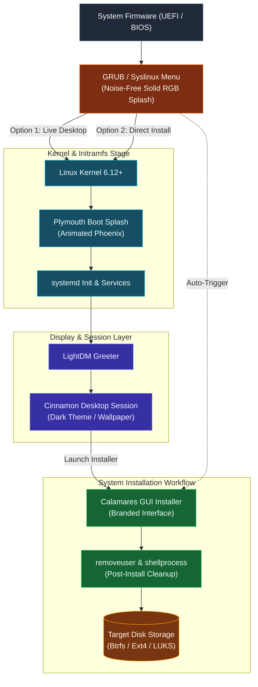

# Eloquence GNU/Linux

Production-grade, Debian-based Linux operating system engineered for enterprise workstations, developers, and dual-architecture deployments across x86_64 and ARM64 platforms — featuring the Cinnamon Desktop Environment, Calamares graphical installer, Plymouth animated boot framework, and a pre-installed productivity software suite.


---

## Table of Contents

* [Overview](#overview)
* [Tech Stack](#tech-stack)
* [Architecture](#architecture)
* [Hardware Specifications](#hardware-specifications)
* [Pre-Installed Applications Inventory](#pre-installed-applications-inventory)
* [Bootloader & Display Infrastructure](#bootloader--display-infrastructure)
* [Installer & System Provisioning](#installer--system-provisioning)
* [Containerized Build Pipeline (Docker)](#containerized-build-pipeline-docker)
* [Repository Structure](#repository-structure)
* [Getting Started & Build Commands](#getting-started--build-commands)
* [Configuration & Security Practices](#configuration--security-practices)
* [Roadmap](#roadmap)
* [Contributing](#contributing)
* [License](#license)

---

## Overview

This repository serves as the single source of truth for the build, packaging, and configuration pipeline of Eloquence GNU/Linux. The operating system utilizes Debian Trixie as its foundation, coupled with the Cinnamon Desktop Environment, modern typography, custom system branding, and automated Calamares system deployment.

### Key Functional Domains:
* **`auto/`** — Live-build automation parameters, kernel bootstrap configs, and cross-architecture target declarations.
* **`config/bootloaders/`** — GRUB EFI, GRUB PC, and Syslinux noise-free solid RGB splash configurations and boot menus.
* **`config/calamares/`** — Graphical installer settings, Eloquence Phoenix branding assets, and post-installation cleanup hooks.
* **`config/package-lists/`** — Manifest declarations for core packages, desktop stacks, and productivity utilities.
* **`config/includes.chroot/`** — Overlay filesystems covering wallpapers, terminal MOTD banners, LightDM, and dconf databases.
* **`scripts/`** — Master image creation, live filesystem preparation, and ISO verification tooling.

---

## Tech Stack

| Layer | Technology |
| --- | --- |
| **Base Distribution** | Debian GNU/Linux (Trixie testing core) |
| **Desktop Environment** | Cinnamon Desktop (GTK3 dark theme, Adwaita suite) |
| **Display Manager** | LightDM with LightDM GTK Greeter (autologin enabled) |
| **System Installer** | Calamares GUI Installer (custom branding, auto cleanup) |
| **Boot Splash** | Plymouth animated boot theme (pulse animation) |
| **Bootloaders** | GRUB 2 (UEFI x86_64/ARM64) & Syslinux (BIOS legacy) |
| **Containerization** | Docker Engine & Docker Compose build container |
| **Virtualization Stack** | QEMU, KVM, Libvirt, Virt-Manager GUI |
| **Core Productivity** | LibreOffice Suite (Writer, Calc, Impress, Draw, Math) |
| **Security & Firewall** | UFW, GUFW GUI, Linux PAM authentication |

---

## Architecture

The boot and installation lifecycle transitions cleanly from firmware initialization to a full graphical desktop environment or direct installer session.



---

## Hardware Specifications

| Component | Minimum Specification | Recommended Specification |
| --- | --- | --- |
| **Processor** | 64-bit Dual-Core (x86_64 or ARM64) | 64-bit Quad-Core CPU (Intel, AMD, Apple Silicon, ARM) |
| **Memory (RAM)** | 2 GB RAM | 4 GB+ DDR4 / LPDDR5 RAM |
| **Storage** | 15 GB Free Disk Space | 30 GB+ NVMe SSD Storage |
| **Graphics** | Standard VGA / Direct Rendering | OpenGL 3.3+ Hardware Acceleration |
| **Display** | 1024 x 768 Resolution | 1920 x 1080 Full HD or 4K Display |

---

## Pre-Installed Applications Inventory

### Office & Productivity
* **LibreOffice Writer:** Full-featured document processor supporting ODF, DOCX, and PDF exports.
* **LibreOffice Calc:** Spreadsheet management, statistical analysis, and graphing utility.
* **LibreOffice Impress:** Presentation software with multimedia transition capabilities.
* **LibreOffice Draw & Math:** Vector drawing and technical formula editor.

### Internet & Communication
* **Firefox ESR:** Privacy-focused, high-performance web browser.
* **Thunderbird:** Integrated email client, address book, and calendar management suite.

### Multimedia & Graphics
* **VLC Media Player:** Universal audio and video playback engine.
* **Rhythmbox:** Local audio library organization and music player.
* **GIMP:** Professional raster graphics editor for image retouching and composition.
* **Inkscape:** Scalable vector graphics editor.
* **Evince & Simple Scan:** Document viewing and hardware document scanning utility.

### System, Security & Virtualization
* **Timeshift:** Automated system restore points and Btrfs/RSync snapshot manager.
* **GParted & GNOME Disk Utility:** Partition management, disk formatting, and S.M.A.R.T. health diagnostics.
* **GUFW & UFW:** Graphical firewall frontend and packet filtering control.
* **Virt-Manager & QEMU/KVM:** Native kernel virtual machine provisioning and hardware passthrough.
* **Synaptic Package Manager:** Advanced graphical APT package management.

---

## Bootloader & Display Infrastructure

* **Noise-Free Solid RGB Splash:** 1920x1080 solid 24-bit canvas (`#17252a`) avoiding dithering artifacts across legacy and UEFI framebuffers.
* **Plymouth Animated Boot Splash:** Configured via system alternatives (`default.plymouth`) for smooth graphical boot transitions.
* **Display Manager (LightDM):** Direct live user autologin (`eloquence`) with PAM permit overrides for passwordless initialization.
* **Lockscreen & Theme Engine:** Cinnamon screensaver, GNOME schemas, and GTK3 forced dark theme (`Adwaita-dark`) using dconf profile defaults.

---

## Installer & System Provisioning

Eloquence GNU/Linux utilizes a customized build of the Calamares installer framework:

* **Visual Identity:** Custom branding stylesheet incorporating the Eloquence Phoenix logo and color scheme.
* **Live Exclusivity:** The installer launcher (`install-eloquence.desktop`) utilizes `OnlyShowIn=X-Live;` to ensure visibility solely inside live sessions.
* **Automated Cleanup Modules:** 
  * `removeuser.conf` — Automatically purges the temporary live user account (`eloquence`) from the target system.
  * `shellprocess.conf` — Deletes live installer desktop shortcuts and skeleton configurations upon installation completion.

---

## Containerized Build Pipeline (Docker)

ISOs can be built reliably across heterogeneous host platforms (macOS, Ubuntu, Fedora, Arch) without polluting host package states:

* **Dockerfile:** Encapsulates `live-build`, `debootstrap`, `squashfs-tools`, `xorriso`, and `qemu-user-static`.
* **Cross-Architecture Support:** Builds `x86_64` (amd64) and `ARM64` (aarch64) ISOs via static user-space binary emulation.
* **Deterministic Output:** Generates hybrid bootable ISO images in the `build_output/` artifact directory.

---

## Repository Structure

```text
eloquence/
├── Dockerfile                         # Containerized build environment
├── docker-compose.yml                 # Compose service for containerized ISO compilation
├── Makefile                           # Unified orchestration targets
├── LICENSE                            # GNU General Public License v3
├── README.md                          # Repository documentation
├── auto/
│   ├── build.sh                       # Live-build hook runner
│   └── config.sh                      # Architecture, kernel, and bootloader definitions
├── config/
│   ├── archives/                      # APT repositories and repository mirrors
│   ├── bootloaders/
│   │   ├── grub-efi/                  # GRUB UEFI configuration and splash.png
│   │   ├── grub-pc/                   # GRUB BIOS configuration and splash.png
│   │   └── syslinux/                  # Syslinux live.cfg and menu.cfg definitions
│   ├── calamares/
│   │   ├── branding/eloquence/        # Calamares visual assets, logo, and branding.desc
│   │   ├── modules/                   # Custom removeuser and shellprocess cleanup configs
│   │   └── settings.conf              # Module execution sequence
│   ├── desktop-entries/               # Standard XDG application shortcuts
│   ├── hooks/normal/
│   │   └── 099-eloquence-branding.chroot # User creation, Plymouth, and branding hook
│   ├── includes.chroot/               # Root filesystem overlay
│   │   ├── boot/grub/                 # Boot splash assets
│   │   ├── etc/
│   │   │   ├── dconf/db/local.d/      # Cinnamon and GTK dark theme schemas
│   │   │   ├── lightdm/               # LightDM greeter and autologin settings
│   │   │   ├── motd                   # Clean Eloquence terminal message of the day
│   │   │   ├── os-release             # System release metadata
│   │   │   └── skel/Desktop/          # Default desktop shortcuts
│   │   └── usr/share/
│   │       ├── calamares/branding/    # Systemwide Calamares fallback branding
│   │       ├── pixmaps/               # System icons and logo assets
│   │       └── wallpapers/            # Eloquence Dark Space wallpaper
│   └── package-lists/
│       └── eloquence.list.chroot      # Curated package stack (Desktop, Apps, Tools)
└── scripts/
    ├── build.sh                       # Master image build script
    └── verify-iso.sh                  # Post-build ISO verification utility
```

---

## Getting Started & Build Commands

### 1. Dual-Architecture & Individual Build Commands

Generate production ISO images for both or individual architectures:

```bash
# Build BOTH x86_64 and ARM64 ISOs sequentially:
make build-iso-all

# Or build individually:
make build-iso-x64     # Target x86_64 / amd64
make build-iso-arm64   # Target ARM64 / aarch64
```

### 2. Containerized Build (Docker)

```bash
# Build BOTH architectures inside Docker container:
make docker-iso-all

# Or build individually inside Docker:
make docker-iso-x64
make docker-iso-arm64
```

### 3. Syntax & Configuration Validation

```bash
make test
```

---

## Configuration & Security Practices

* **Live Security:** Live user operates with passwordless sudo permissions for demonstration and rescue purposes; installed systems enforce standard user creation and PAM authentication.
* **No Telemetry:** The operating system does not include third-party tracking, telemetry services, or data harvesting daemons.
* **Firewall Defaults:** UFW is pre-installed with standard restrictive incoming packet policies.
* **Vulnerability Reporting:** See `SECURITY.md` for disclosure procedures.

---

## Roadmap

* Official netboot (iPXE) installation endpoint support.
* Custom lightweight CLI-only edition tailored for cloud compute nodes.
* Automated ZFS-on-root installation module for Calamares.

---

## Contributing

Review `CONTRIBUTING.md` prior to submitting pull requests, modifying package lists, or altering branding assets.

---

## License

Licensed under the terms of the GNU General Public License v3.0 outlined in [LICENSE](LICENSE).

Copyright (C) 30 October 2025 Eloquence GNU/Linux.
